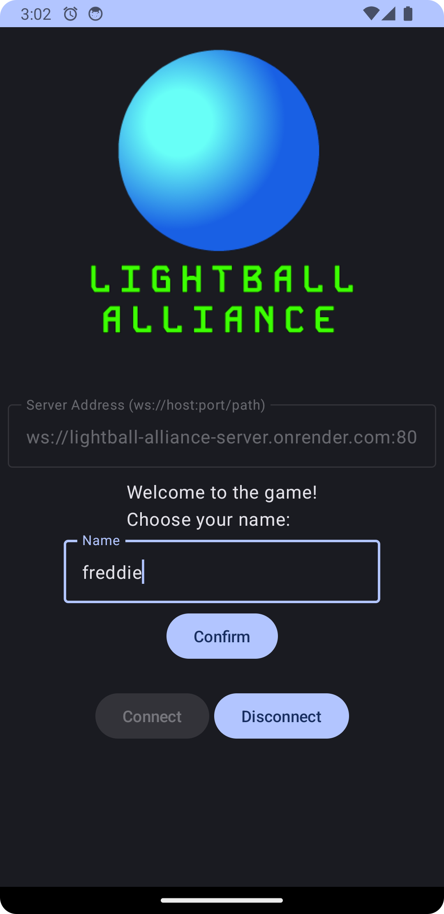
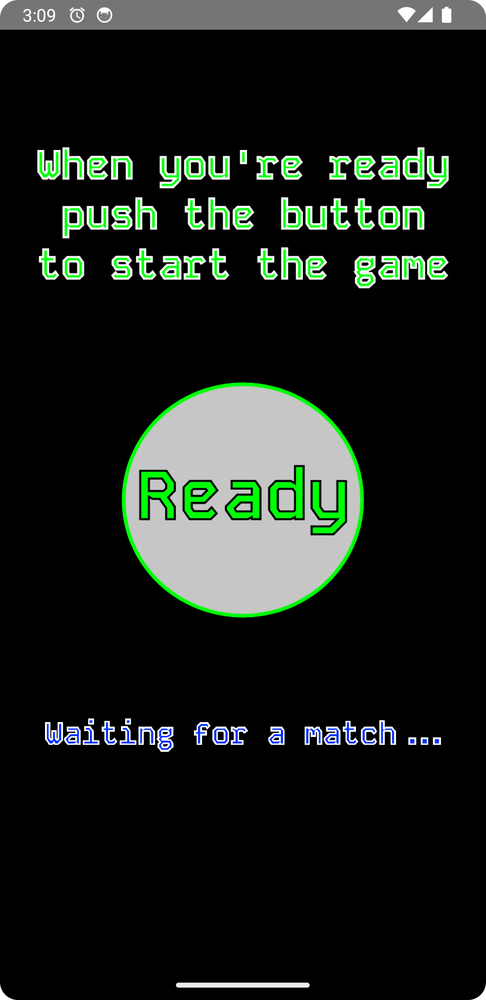
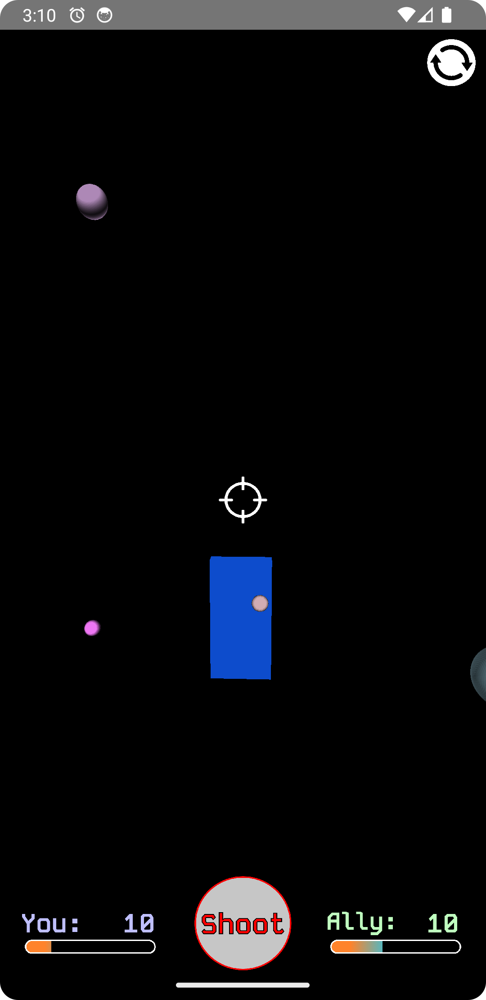
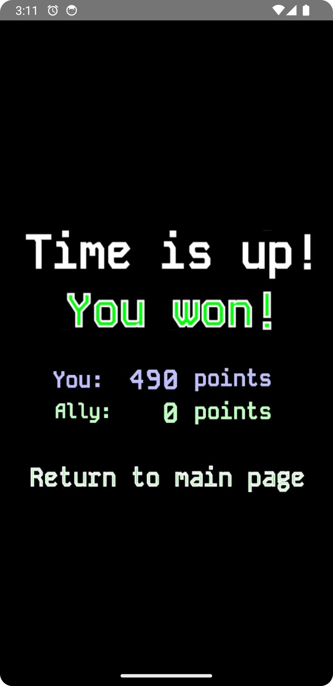
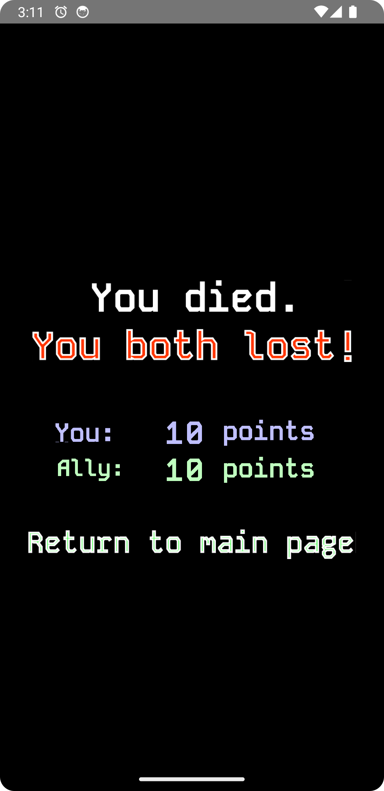
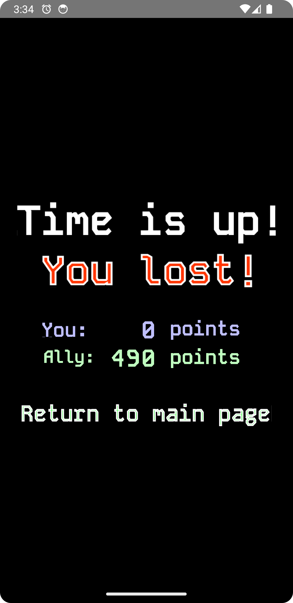

# Lightball Alliance
Final project for the Mobile Applications and Cloud Computing course at Sapienza University of Rome, a.y. 2023/2024.

It consists of a small shooting game in which two allies are matched to fight back the incoming enemies. The game frontend is written in Kotlin, while the backend is written in Python.

## Authors
- [@Cicim](https://github.com/Cicim) &mdash; backend, communication protocol, rotation logic, game logic;
- [@Claziero](https://github.com/Claziero) &mdash; all graphics, Jetpack Compose UI, sensor reading, OpenGL rendering.

## How to play
- Connect to the game server (or provide your own server's address).
- Provide a username and confirm.
- You will then be matched with another player.
- When you press the "Ready" button, the game will start as soon as the other player is ready too.
- The game consists of pointing at the enemies and shooting them by tapping the "Shoot" button. Shooting has a cooldown of one second. The game ends after two minutes and the player with the highest score wins. If any player disconnects or loses all its lives, the game ends immediately for both players.
- You always have access to a calibration button, which will reset the rotation of the device to the current position. This is useful if you are playing while lying down or in a non-standard position.
- Once the game ends, you will be able to see the final score and the winner, or if it's a tie.

  
  
  
  
  
  

## Features
- Real-time multiplayer game using WebSockets.
    > You always see where your ally is looking at and you share the same enemies.

- OpenGL rendering for the game graphics (with shaders).
    > The game is rendered using OpenGL ES 2.0, which allows for better performance and more complex graphics (beautiful cubes and spheres, for example).

- Sensor reading for the device's rotation.
    > The game uses the game rotation vector sensor to detect the device's rotation and use it to aim at the enemies.

- Device rotation calibration and interpolation for a better gaming experience on devices with lower sampling rates using SLERP.
    > The game allows you to calibrate the rotation of the device to the current position, and uses SLERP to interpolate between the current and the previous rotation to avoid sudden changes in the aiming direction.

- Custom graphics for the HUD and interface.
    > The game has a custom interface and HUD, with a beautiful background and buttons that change color when pressed.

- Easy cloud deployment.
    > The server is minimalistic and only really requires a port number and an address to run. It can be deployed on any cloud provider with minimal effort.

## Technologies
- Kotlin for the Android app.
- Python (with the `aiohttp` package) for the server.
- OpenGL ES 2.0 for the game rendering.
- WebSockets for the real-time communication between the server and the clients.
- Android Jetpack for the UI and the app lifecycle management, namely remembering the server address on the MainActivity.

## How to run
- The server can be run with Python 3.8 or later. It requires the `aiohttp` package, which can be installed with `pip install aiohttp`. Then, run the server with `python server.py`.
- You can build the Android app with Android Studio or simply download it from the releases page and install it on your device.
- Now you can connect to the server and play the game!

## License
This project is licensed under the MIT License.

> Permission is hereby granted, free of charge, to any person obtaining a copy of this software and associated documentation files (the "Software"), to deal in the Software without restriction, including without limitation the rights to use, copy, modify, merge, publish, distribute, sublicense, and/or sell copies of the Software, and to permit persons to whom the Software is furnished to do so, subject to the following conditions:
> 
> The above copyright notice and this permission notice shall be included in all copies or substantial portions of the Software.
> 
> THE SOFTWARE IS PROVIDED "AS IS", WITHOUT WARRANTY OF ANY KIND, EXPRESS OR IMPLIED, INCLUDING BUT NOT LIMITED TO THE WARRANTIES OF MERCHANTABILITY, FITNESS FOR A PARTICULAR PURPOSE AND NONINFRINGEMENT. IN NO EVENT SHALL THE AUTHORS OR COPYRIGHT HOLDERS BE LIABLE FOR ANY CLAIM, DAMAGES OR OTHER LIABILITY, WHETHER IN AN ACTION OF CONTRACT, TORT OR OTHERWISE, ARISING FROM, OUT OF OR IN CONNECTION WITH THE SOFTWARE OR THE USE OR OTHER DEALINGS IN THE SOFTWARE.
